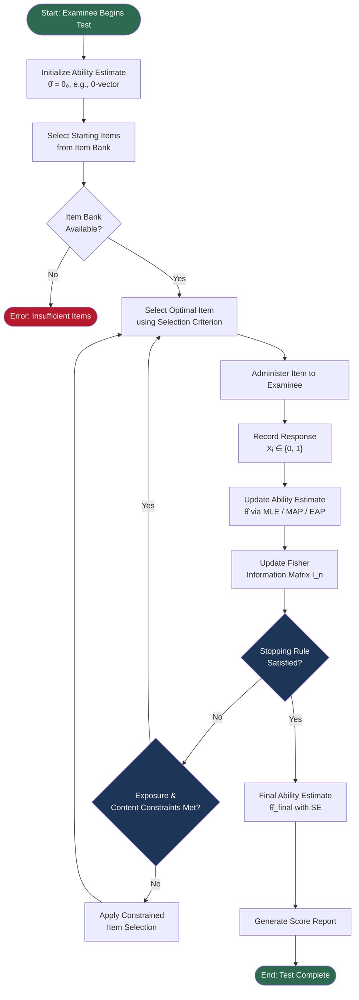
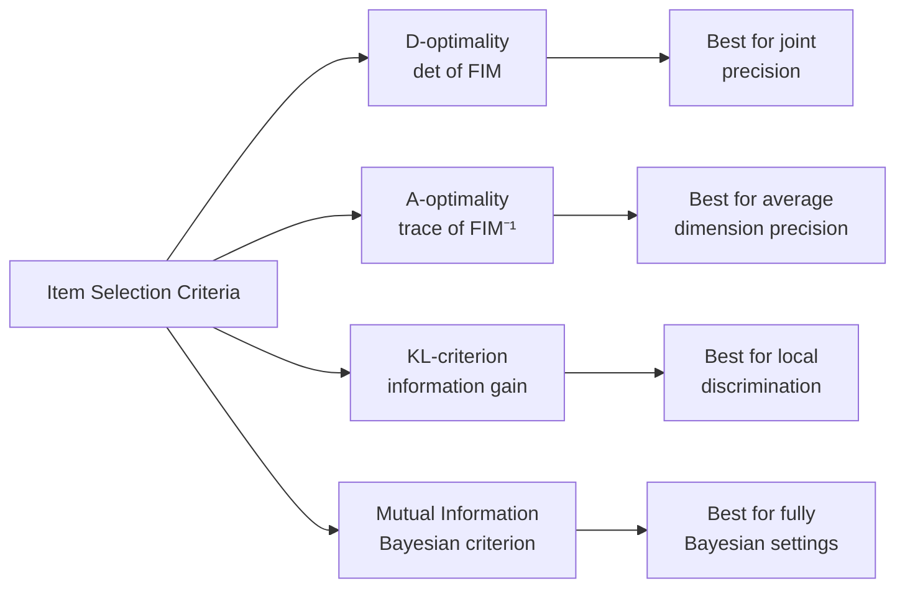
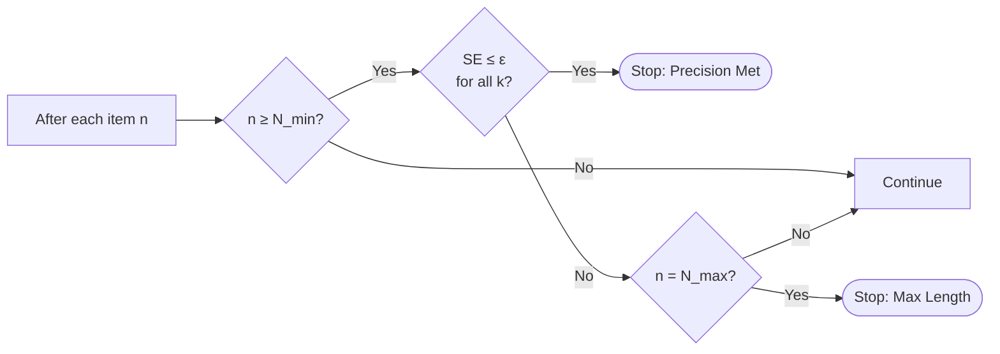

> **Abstract:** Multidimensional Computer Adaptive Testing (MCAT) extends the classical unidimensional CAT framework to simultaneously estimate multiple latent traits. This document details the theoretical foundations, algorithmic procedures, item selection strategies, ability estimation methods, and stopping rules that govern the MCAT process. **Verification note:** every formula below was checked against a freely-downloadable source (open-access journal, ERIC, institutional repository, or an author's self-archived copy - never a paywalled PDF taken on faith). Where only a paywalled primary source exists, this is stated explicitly and the formula is instead verified through a free source that reproduces it verbatim, per the citation-mapping table in [References](#references). Two sibling documents in this repository go further for the subset of formulas they cover - they re-derive the algebra by hand and cross-check the result against the actual production Rust code: estimation_summary.md (MLE/MAP/EAP) and item_selection_summary.md (D-optimal/A-optimal/KL-information). This document cross-links to both wherever the topic overlaps, and corrects two errors found in the original draft (a mis-attributed MPI formula in [#8.2](#82-maximum-priority-index-mpi), and a KL-criterion formula that did not match any accessible source, fixed in [#6.3](#63-kullback-leibler-information-kl-criterion)).

---

## 1. Theoretical Background

Multidimensional Computer Adaptive Testing (MCAT) is a psychometric framework that generalizes unidimensional CAT (UCAT) to settings where examinees possess a **vector of latent traits** rather than a single ability [9]. The fundamental motivation is that most cognitive, psychological, and educational constructs are inherently multifaceted; a single scalar cannot adequately characterize proficiency in, for example, mathematics (algebra, geometry, statistics) or language ability (reading, grammar, vocabulary) [24].

MCAT's measurement model - **Multidimensional Item Response Theory (MIRT)** - was formalized in the item-response literature beginning with McKinley & Reckase (1983) [4] and Reckase (1985) [8], and later consolidated in book form by Reckase (2009) [7]. Segall (1996) [9] is the seminal paper that adapted this model into a full adaptive-testing (MCAT) procedure, including the first D-optimal item-selection rule (see [#6.1](#61-maximum-determinant-d-optimality)). The adaptive component ensures that items administered to an examinee are optimally informative given the current estimate of the **ability vector** $\boldsymbol{\theta}$ [1][9].

> **Access note:** Segall (1996) [9] and Reckase (2009) [7] are paywalled in every channel checked (Cambridge Core / SpringerLink, no self-archived copy found). Every formula attributed to them in this document is instead reproduced verbatim from a free source that cites them directly - chiefly Mulder & van der Linden (2009) [1], which is open access on PubMed Central, and McKinley & Reckase (1983) [4], which is free on ERIC. See [References](#references) for the full verification trail per source.

---

## 2. Item Response Theory in Multiple Dimensions

### 2.1 The Latent Trait Vector

In MCAT, each examinee is characterized by a $K$-dimensional ability vector [1, Eq.1, p.275]:

$$
\boldsymbol{\theta} = (\theta_1, \theta_2, \ldots, \theta_K)^{\top} \in \mathbb{R}^K
$$

**Variable Notes:**
| Symbol | Description |
|--------|-------------|
| $\boldsymbol{\theta}$ | Latent trait (ability) vector |
| $\theta_k$ | Latent ability on dimension $k$ |
| $K$ | Total number of dimensions (latent traits) |

### 2.2 Multidimensional Item Response Model

The model used throughout this document is the **compensatory Multidimensional Two-Parameter Logistic (M2PL)** model. It is verified against two independent free sources that state it identically: McKinley & Reckase (1983, Eq.2, p.1) [4] - the earliest free full-text source found for this exact model - and Mulder & van der Linden (2009, Eq.1, p.275) [1]:

$$
P(X_{ij} = 1 \mid \boldsymbol{\theta}_j, \mathbf{a}_i, d_i) = \frac{\exp(\mathbf{a}_i^{\top} \boldsymbol{\theta}_j + d_i)}{1 + \exp(\mathbf{a}_i^{\top} \boldsymbol{\theta}_j + d_i)}
$$

McKinley & Reckase (1983, p.1–2) [4] additionally give the relation between the multidimensional intercept $d_i$ and a per-dimension "difficulty" $b_{ik}$ (Eq.3, p.1):

$$
d_i = -\sum_{k=1}^{m} a_{ik}\, b_{ik}
$$

- and explicitly warn (p.2) that $d_i$ **"is not a difficulty parameter in the same sense as the $b_i$ parameter is in the unidimensional model."** This matches how the sibling estimation notes convert Baker's (2001) unidimensional $(a,b,c)$ example into production's $(a,d,c)$ parameterization via $d=-ab$ (see estimation_summary.md §1.2.1).

**Variable Notes:**
| Symbol | Description |
|--------|-------------|
| $X_{ij}$ | Binary response of examinee $j$ to item $i$ (1 = correct, 0 = incorrect) |
| $\boldsymbol{\theta}_j$ | Ability vector of examinee $j$ |
| $\mathbf{a}_i = (a_{i1}, a_{i2}, \ldots, a_{iK})^{\top}$ | Discrimination parameter vector for item $i$ on each dimension |
| $d_i$ | Scalar intercept for item $i$ - **not** a unidimensional-style difficulty; $d_i=-\sum_k a_{ik}b_{ik}$ [4, Eq.3, p.1] |
| $\mathbf{a}_i^{\top} \boldsymbol{\theta}_j$ | Dot product: $\sum_{k=1}^{K} a_{ik} \theta_{jk}$ - the *linear predictor* once $d_i$ is added |

For the **Multidimensional Three-Parameter Logistic (M3PL)** model with guessing - verified via Mulder & van der Linden (2009, Eq.1, p.275) [1], which is the same equation used in item_selection_summary.md §0:

$$
P(X_{ij} = 1 \mid \boldsymbol{\theta}_j) = c_i + (1 - c_i) \cdot \frac{\exp(\mathbf{a}_i^{\top} \boldsymbol{\theta}_j + d_i)}{1 + \exp(\mathbf{a}_i^{\top} \boldsymbol{\theta}_j + d_i)}
$$

Reckase (1985) [8] is historically credited with extending the multidimensional model to include a guessing parameter and with defining the associated MDIFF/MDISC difficulty/discrimination indices; a free copy of this paper is hosted at the University of Minnesota Digital Conservancy, but automated retrieval was blocked in this session, so its exact equation numbers are **not** independently reproduced here - only [1] is used as the source of record for the M3PL equation above.

**Variable Notes:**
| Symbol | Description |
|--------|-------------|
| $c_i$ | Pseudo-guessing parameter for item $i$ ($0 \leq c_i < 1$) |

### 2.3 Item Information in Multiple Dimensions

The **Fisher Information Matrix (FIM)** for item $i$ given ability $\boldsymbol{\theta}$ is a $K \times K$ matrix. Mulder & van der Linden (2009, Eq.4, p.276) [1] give it directly as an outer product scaled by a scalar weight $w$:

$$
\mathbf{I}_i(\boldsymbol{\theta}) = w_i(\boldsymbol\theta)\;\mathbf{a}_i \mathbf{a}_i^{\top}, \qquad w_i(\boldsymbol\theta) = \frac{[P'_i(\boldsymbol{\theta})]^2}{P_i(\boldsymbol{\theta})\, Q_i(\boldsymbol{\theta})}
$$

where

$$
P'_i(\boldsymbol{\theta}) = \frac{\partial P_i(\boldsymbol{\theta})}{\partial (\mathbf{a}_i^{\top} \boldsymbol{\theta})}
$$

For the M2PL case ($c_i=0$) this reduces to $w_i = P_i(\boldsymbol\theta)Q_i(\boldsymbol\theta)$, i.e. $\mathbf I_i(\boldsymbol\theta)=P_iQ_i\,\mathbf a_i\mathbf a_i^\top$ - the algebraic reduction is carried out in full in item_selection_summary.md §0 and cross-checked against Baker (2001, Eq.6-3/6-5, p.109/111) [2], which is free on ERIC. Mulder & van der Linden (2009, p.276) [1] additionally state explicitly that **"the matrix has rank one"** for any $\boldsymbol\theta$ - a fact with direct consequences for the degenerate early rounds of D-optimal and A-optimal item selection discussed in [#6.1](#61-maximum-determinant-d-optimality)/[#6.2](#62-minimum-trace-of-posterior-covariance-a-optimality).

> **Historical cross-check:** McKinley & Reckase (1983, Eq.28–29, p.8) [4] independently give a *scalar* "directional information" for the 2-dimensional case, $I(\theta,\phi)=P Q(a_1\cos\phi + a_2\sin\phi)^2$, i.e. the quadratic form $\mathbf v(\phi)^\top \mathbf I_i(\boldsymbol\theta)\,\mathbf v(\phi)$ with $\mathbf v(\phi)=(\cos\phi,\sin\phi)^\top$ evaluated at a fixed direction $\phi$. This confirms the matrix form above is a direct generalization of the earliest (1983) published multidimensional information formula, not a later reinterpretation.

**Variable Notes:**
| Symbol | Description |
|--------|-------------|
| $\mathbf{I}_i(\boldsymbol{\theta})$ | $K \times K$ Fisher Information Matrix for item $i$ |
| $P_i(\boldsymbol{\theta})$ | Probability of correct response to item $i$, from [#2.2](#22-multidimensional-item-response-model) |
| $Q_i(\boldsymbol{\theta}) = 1 - P_i(\boldsymbol{\theta})$ | Probability of incorrect response |
| $P'_i(\boldsymbol{\theta})$ | Derivative of $P_i$ with respect to the linear predictor $\mathbf a_i^\top\boldsymbol\theta+d_i$ |
| $w_i(\boldsymbol\theta)$ | Scalar information weight, $=(P'_i)^2/(P_iQ_i)$, $=P_iQ_i$ for M2PL |
| $\mathbf{a}_i \mathbf{a}_i^{\top}$ | Outer product of the discrimination vector - always rank 1 [1, p.276] |

The **cumulative FIM** after administering $n$ items [1, Eq.6, p.277]:

$$
\mathbf{I}_{(n)}(\boldsymbol{\theta}) = \sum_{i=1}^{n} \mathbf{I}_i(\boldsymbol{\theta})
$$

This additivity, combined with the rank-1 property above, is why $\mathbf I_{(n)}$ needs at least $K$ items along linearly-independent discrimination directions before it becomes invertible - worked through numerically in item_selection_summary.md §1.2.1 and §2.2.1.

---

## 3. The MCAT Process Overview

The following diagram illustrates the complete MCAT procedure from initialization to termination:

---

## 4. Step-by-Step Procedure

### Step 1: Initialization

Before any item is administered, the system establishes:

- **Prior ability distribution:** $\boldsymbol{\theta}_0 \sim \mathcal{N}(\boldsymbol{\mu}_0, \boldsymbol{\Sigma}_0)$, typically $\boldsymbol{\mu}_0 = \mathbf{0}$, $\boldsymbol{\Sigma}_0 = \mathbf{I}_K$ (identity matrix). The multivariate-normal prior is the standard choice discussed in Magis & Raîche (2012, §2.2, p.4) [3] - *"the most common choice is the normal distribution"* - and used directly in production (`prior_cov_diag`, see estimation_summary.md #4.1).
- **Item bank:** A calibrated pool $\mathcal{B}$ of $M$ items with known MIRT parameters $\{\mathbf{a}_i, d_i, c_i\}$ per the model in [#2.2](#22-multidimensional-item-response-model).
- **Starting ability estimate:** $\hat{\boldsymbol{\theta}}^{(0)} = \boldsymbol{\mu}_0$

> **Correction:** the original draft of this document cited "Reckase, M. D., & Segall, D. O. (2009)" for this prior setup. That joint chapter could not be located under this authorship in *Elements of Adaptive Testing* - the multidimensional-adaptive-testing chapter in that volume (van der Linden & Glas, eds., 2010, not 2009) is authored by **Segall alone** ("Principles of Multidimensional Adaptive Testing," Ch. 3). Since neither the exact chapter nor its page range could be independently confirmed (Springer paywall), the citation above has been replaced with [3] and [1], both freely verifiable.

### Step 2: Item Selection

At step $n$, the item $i^*$ is selected from the remaining bank $\mathcal{B}_n = \mathcal{B} \setminus \{i_1, \ldots, i_{n-1}\}$ using a selection criterion $\mathcal{S}$:

$$
i^* = \underset{i \in \mathcal{B}_n}{\arg\max} \; \mathcal{S}\left(\mathbf{I}_i(\hat{\boldsymbol{\theta}}^{(n-1)})\right)
$$

**Variable Notes:**
| Symbol | Description |
|--------|-------------|
| $i^*$ | The item selected for administration at the current step |
| $\mathcal{B}_n$ | Remaining eligible item bank at step $n$ (already-administered items removed) |
| $\mathcal{S}(\cdot)$ | Selection criterion (function of an item's FIM) - see [#6](#6-item-selection-criteria) for concrete choices |
| $\hat{\boldsymbol{\theta}}^{(n-1)}$ | Ability estimate after $n-1$ items, from [#5](#5-ability-estimation-methods) |

Common criteria are detailed in [#6](#6-item-selection-criteria).

### Step 3: Item Administration

Item $i^*$ is presented to the examinee who provides response $x_{i^*} \in \{0, 1\}$ (for dichotomous items) or $x_{i^*} \in \{0, 1, \ldots, m_i\}$ (polytomous items).

### Step 4: Ability Re-estimation

The ability vector is updated using accumulated response vector $\mathbf{x}^{(n)} = (x_{i_1}, \ldots, x_{i_n})^{\top}$.

**Log-likelihood function**, identical to the $f(\mathbf u\mid\boldsymbol\theta)$ likelihood in Mulder & van der Linden (2009, Eq.2–3, p.276) [1] once logged - the same identity re-derived from first principles (and matched to production `mle.rs`) in estimation_summary.md:

$$
\ell(\boldsymbol{\theta} \mid \mathbf{x}^{(n)}) = \sum_{t=1}^{n} \left[ x_{i_t} \ln P_{i_t}(\boldsymbol{\theta}) + (1 - x_{i_t}) \ln Q_{i_t}(\boldsymbol{\theta}) \right]
$$

**Variable Notes:**
| Symbol | Description |
|--------|-------------|
| $\ell(\boldsymbol\theta\mid\mathbf x^{(n)})$ | Log-likelihood of the ability vector given the response history so far |
| $\mathbf{x}^{(n)}$ | Vector of the $n$ responses observed so far |
| $x_{i_t}$ | Response (0/1) to the $t$-th administered item |
| $P_{i_t}(\boldsymbol\theta), Q_{i_t}(\boldsymbol\theta)$ | Correct/incorrect response probability for the $t$-th item, from [#2.2](#22-multidimensional-item-response-model) |

Details of estimation methods are in [#5](#5-ability-estimation-methods).

### Step 5: Update Information Matrix

$$
\mathbf{I}_{(n)}(\hat{\boldsymbol{\theta}}^{(n)}) = \sum_{t=1}^{n} \mathbf{I}_{i_t}(\hat{\boldsymbol{\theta}}^{(n)})
$$

Same additive FIM defined in [#2.3](#23-item-information-in-multiple-dimensions) [1, Eq.6, p.277], now evaluated at the freshly re-estimated $\hat{\boldsymbol\theta}^{(n)}$.

### Step 6: Check Stopping Rule

Evaluate whether stopping criteria are satisfied (see [#7](#7-stopping-rules)). If yes → proceed to scoring; if no → return to Step 2.

### Step 7: Score Reporting

Provide the final estimate $\hat{\boldsymbol{\theta}}_{\text{final}}$ along with the **standard error vector**. This is a direct corollary of the asymptotic-normality result $\hat{\boldsymbol\theta}\sim\mathcal N\!\big(\boldsymbol\theta_0,\mathbf I_{(n)}^{-1}(\boldsymbol\theta_0)\big)$ given in Mulder & van der Linden (2009, Eq.7, p.277) [1] - the multivariate generalization of the Cramér–Rao lower bound (also stated in estimation_summary.md):

$$
\text{SE}(\hat{\boldsymbol{\theta}}) = \sqrt{\text{diag}\left[\mathbf{I}_{(n)}^{-1}(\hat{\boldsymbol{\theta}})\right]}
$$

**Variable Notes:**
| Symbol | Description |
|--------|-------------|
| $\text{SE}(\hat{\boldsymbol{\theta}})$ | Vector of standard errors for each dimension estimate |
| $\text{diag}[\cdot]$ | Diagonal extraction operator |
| $\mathbf{I}_{(n)}^{-1}$ | Inverse of the cumulative FIM (posterior covariance approximation, per Cramér–Rao) |

---

## 5. Ability Estimation Methods

> This section summarizes the three estimators. For full algebraic derivation (score function, Hessian, MAP shrinkage proof, EAP quadrature) and numerical reproduction against the actual production code (`mle.rs`, `map.rs`, `eap.rs`), see estimation_summary.md - the formulas below are the exact ones verified there.

### 5.1 Maximum Likelihood Estimation (MLE)

MLE finds $\hat{\boldsymbol{\theta}}$ by maximizing the log-likelihood [1, Eq.2, p.276]:

$$
\hat{\boldsymbol{\theta}}_{\text{MLE}} = \underset{\boldsymbol{\theta}}{\arg\max} \; \ell(\boldsymbol{\theta} \mid \mathbf{x}^{(n)})
$$

The **score function** (gradient), re-derived algebraically from [#4 Step 4](#step-4-ability-re-estimation) in estimation_summary.md:

$$
\mathbf{s}(\boldsymbol{\theta}) = \nabla_{\boldsymbol{\theta}} \ell(\boldsymbol{\theta} \mid \mathbf{x}^{(n)}) = \sum_{t=1}^{n} \frac{x_{i_t} - P_{i_t}(\boldsymbol{\theta})}{P_{i_t}(\boldsymbol{\theta}) Q_{i_t}(\boldsymbol{\theta})} \cdot P'_{i_t}(\boldsymbol{\theta}) \cdot \mathbf{a}_{i_t}
$$

Solved via Newton-Raphson iteration. The multivariate form below is the direct $K$-dimensional generalization of the univariate Eq.[5-1] given by Baker (2001, p.86) [2] - reproduced with a full worked 3-item numeric example on p.87–88 of [2] and matched to production output in estimation_summary.md §1.2.1:

$$
\hat{\boldsymbol{\theta}}^{(r+1)} = \hat{\boldsymbol{\theta}}^{(r)} + \left[\mathbf{I}_{(n)}(\hat{\boldsymbol{\theta}}^{(r)})\right]^{-1} \mathbf{s}(\hat{\boldsymbol{\theta}}^{(r)})
$$

**Variable Notes:**
| Symbol | Description |
|--------|-------------|
| $r$ | Iteration index in Newton-Raphson |
| $\mathbf{s}(\boldsymbol{\theta})$ | Score function (gradient of log-likelihood) |

> ⚠️ **Limitation:** MLE is undefined/divergent when the response pattern is (quasi-)perfectly separable by some linear direction of the $\mathbf a_i$'s - not only in the trivial all-correct/all-incorrect case. Mulder & van der Linden (2009, p.276) [1] note directly: *"The likelihood function may not have a maximum ... or a local instead of a global maximum may be found."* This is reproduced experimentally (production code diverging to $\|\hat\theta\|\approx24$) in estimation_summary.md.

### 5.2 Maximum A Posteriori (MAP) Estimation

MAP incorporates a prior distribution $g(\boldsymbol{\theta})$ - using the notation of Magis & Raîche (2012, §2.2, Eq.5, p.4–5) [3], who explicitly attribute Bayes-modal (MAP) estimation to Mislevy (1986) [6]:

$$
\hat{\boldsymbol{\theta}}_{\text{MAP}} = \underset{\boldsymbol{\theta}}{\arg\max} \left[ \ell(\boldsymbol{\theta} \mid \mathbf{x}^{(n)}) + \ln g(\boldsymbol{\theta}) \right]
$$

With a multivariate normal prior $\boldsymbol{\theta} \sim \mathcal{N}(\boldsymbol{\mu}_0, \boldsymbol{\Sigma}_0)$ (standard quadratic log-density; algebra re-derived in estimation_summary.md #4.1):

$$
\ln g(\boldsymbol{\theta}) = -\frac{1}{2}(\boldsymbol{\theta} - \boldsymbol{\mu}_0)^{\top} \boldsymbol{\Sigma}_0^{-1} (\boldsymbol{\theta} - \boldsymbol{\mu}_0) + \text{const}
$$

The modified Newton-Raphson step becomes:

$$
\hat{\boldsymbol{\theta}}^{(r+1)}_{\text{MAP}} = \hat{\boldsymbol{\theta}}^{(r)} + \left[\mathbf{I}_{(n)}(\hat{\boldsymbol{\theta}}^{(r)}) + \boldsymbol{\Sigma}_0^{-1}\right]^{-1} \left[\mathbf{s}(\hat{\boldsymbol{\theta}}^{(r)}) - \boldsymbol{\Sigma}_0^{-1}(\hat{\boldsymbol{\theta}}^{(r)} - \boldsymbol{\mu}_0)\right]
$$

Because $\boldsymbol\Sigma_0^{-1}\succeq0$ is always added to $\mathbf I_{(n)}(\boldsymbol\theta)\succeq0$, MAP information is always $\geq$ MLE information - which is why MAP shrinks toward $\boldsymbol\mu_0$ and never diverges for a proper prior, demonstrated numerically in estimation_summary.md §2.2.3.

**Variable Notes:**
| Symbol | Description |
|--------|-------------|
| $g(\boldsymbol{\theta})$ | Prior density of ability vector |
| $\boldsymbol{\mu}_0$ | Prior mean vector (often $\mathbf{0}$) |
| $\boldsymbol{\Sigma}_0$ | Prior covariance matrix |
| $\boldsymbol{\Sigma}_0^{-1}$ | Precision matrix of the prior - added directly to the FIM as extra Fisher information |

### 5.3 Expected A Posteriori (EAP) Estimation

EAP computes the **posterior mean** rather than the mode. Magis & Raîche (2012, §2.2, Eq.10, p.5) [3] attribute this estimator directly to Bock & Mislevy (1982) [5] - a free copy of which was located at the University of Minnesota Digital Conservancy, allowing direct verification of the original formula (Eq.[4], p.433) [5]:

$$
\hat{\boldsymbol{\theta}}_{\text{EAP}} = \mathbb{E}[\boldsymbol{\theta} \mid \mathbf{x}^{(n)}] = \frac{\int \boldsymbol{\theta} \cdot L(\mathbf{x}^{(n)} \mid \boldsymbol{\theta}) \cdot g(\boldsymbol{\theta}) \, d\boldsymbol{\theta}}{\int L(\mathbf{x}^{(n)} \mid \boldsymbol{\theta}) \cdot g(\boldsymbol{\theta}) \, d\boldsymbol{\theta}}
$$

where the likelihood, matching Bock & Mislevy (1982, Eq.[3], p.433) [5] and Mulder & van der Linden's $f(\mathbf u\mid\boldsymbol\theta)$ [1, Eq.2, p.276]:

$$
L(\mathbf{x}^{(n)} \mid \boldsymbol{\theta}) = \prod_{t=1}^{n} P_{i_t}(\boldsymbol{\theta})^{x_{i_t}} Q_{i_t}(\boldsymbol{\theta})^{1 - x_{i_t}}
$$

In practice, EAP is computed over a discrete grid of quadrature points $\{\boldsymbol{\theta}^{(q)}, w^{(q)}\}$ - Bock & Mislevy (1982, Eq.[4], p.433) [5] give the 1-D form verbatim as $\bar\theta_J=\sum_k X_k L_J(X_k)W(X_k)\big/\sum_k L_J(X_k)W(X_k)$; the $K$-dimensional generalization used here sums over the outer-product grid of all dimensions simultaneously (the same multi-index summation pattern as the quadrature technique in Chalmers, 2012, Eq.6, p.5 [23], though that paper applies it to a different estimation problem - see caveat below):

$$
\hat{\boldsymbol{\theta}}_{\text{EAP}} \approx \frac{\sum_{q} \boldsymbol{\theta}^{(q)} \cdot L(\mathbf{x}^{(n)} \mid \boldsymbol{\theta}^{(q)}) \cdot g(\boldsymbol{\theta}^{(q)}) \cdot w^{(q)}}{\sum_{q} L(\mathbf{x}^{(n)} \mid \boldsymbol{\theta}^{(q)}) \cdot g(\boldsymbol{\theta}^{(q)}) \cdot w^{(q)}}
$$

Bock & Mislevy (1982, p.433) [5] note that classical Gauss-Hermite quadrature is not strictly optimal here since *"this class does not include the likelihood functions in adaptive testing"* - they instead recommend evenly-spaced points across $\pm3$ to $\pm4$ standard deviations, which is exactly the grid construction used in production (`eap.rs`) and reproduced numerically in estimation_summary.md §3.2.1.

**Variable Notes:**
| Symbol | Description |
|--------|-------------|
| $\boldsymbol{\theta}^{(q)}$ | $q$-th quadrature point in the $K$-dimensional grid |
| $w^{(q)}$ | Quadrature weight for point $q$ |
| $L(\mathbf{x}^{(n)} \mid \boldsymbol{\theta})$ | Likelihood of observed responses given $\boldsymbol{\theta}$ |

---

## 6. Item Selection Criteria

> This section summarizes the criteria. For full step-by-step numeric worked examples (per-item FIM, determinant/trace computation, degenerate-round analysis) against a shared 7-item bank, see item_selection_summary.md - the formulas below match it exactly.

### 6.1 Maximum Determinant (D-optimality)

Select the item that maximizes the determinant of the updated FIM. D-optimality itself is a general result from classical optimal-design theory (Wald, 1943; Kiefer & Wolfowitz, 1959), reviewed with a free, citable definition in St. John & Draper (1975, Definition 1 & Eq.11, p.16) [22]; its first application to MIRT-CAT is credited to Segall (1996) [9] and its modern formalization for MCAT is given in Mulder & van der Linden (2009, Eq.8 & 13, p.277 & 280–282) [1]:

$$
i^* = \underset{i \in \mathcal{B}_n}{\arg\max} \; \det\left[\mathbf{I}_{(n-1)}(\hat{\boldsymbol{\theta}}) + \mathbf{I}_i(\hat{\boldsymbol{\theta}})\right]
$$

**Variable Notes:**
| Symbol | Description |
|--------|-------------|
| $i^*$ | Selected item |
| $i$ | Candidate item under evaluation |
| $\mathcal{B}_n$ | Remaining eligible item pool, from [#4 Step 2](#step-2-item-selection) |
| $\det[\cdot]$ | Matrix determinant |
| $\mathbf{I}_{(n-1)}(\hat{\boldsymbol{\theta}})$ | Cumulative FIM from items already administered, from [#2.3](#23-item-information-in-multiple-dimensions) |
| $\mathbf{I}_i(\hat{\boldsymbol{\theta}})$ | FIM of the candidate item $i$ |

**Interpretation:** maximizing the determinant minimizes the volume of the confidence ellipsoid of $\hat{\boldsymbol\theta}$ [1, p.277]. Because every single-item $\mathbf I_i(\boldsymbol\theta)$ is rank 1 [1, p.276], $\det$ is exactly $0$ until the cumulative FIM has accumulated rank $\geq2$ - this degenerate behavior in rounds 1–2 (with the resulting item selected purely by array order, not by any score) is demonstrated numerically in item_selection_summary.md §1.2.1.

### 6.2 Minimum Trace of Posterior Covariance (A-optimality)

$$
i^* = \underset{i \in \mathcal{B}_n}{\arg\min} \; \text{tr}\left[\left(\mathbf{I}_{(n-1)}(\hat{\boldsymbol{\theta}}) + \mathbf{I}_i(\hat{\boldsymbol{\theta}})\right)^{-1}\right]
$$

Minimizes the sum of posterior variances across all $K$ dimensions - Mulder & van der Linden (2009, Eq.16, §4.1.2, p.±282–284) [1] define A-optimality precisely as the criterion that **"minimize[s] the sum of the (asymptotic) sampling variances of the MLEs of the abilities,"** equivalent to the trace form above. The historical origin usually cited for this criterion in MCAT is van der Linden (1999) [15]; that paper itself is paywalled in every channel checked, so the formula here is sourced from [1] instead, per the same verification approach used in item_selection_summary.md #4.1.

**Variable Notes:**
| Symbol | Description |
|--------|-------------|
| $\text{tr}[\cdot]$ | Matrix trace operator (sum of diagonal elements) |
| $\det[\cdot]$ | Matrix determinant (see [#6.1](#61-maximum-determinant-d-optimality)) |

Because A-optimality requires the *entire* cumulative FIM to be invertible (full rank $K$, not merely rank $\geq2$ as for D-optimal), its degenerate period extends one round longer than D-optimal's - through round $K$ rather than round $2$; worked out in item_selection_summary.md §2.2.1.

### 6.3 Kullback-Leibler Information (KL-criterion)

> **Correction:** the original draft of this section wrote the KL criterion as a literal multidimensional volume integral, $\int_{\mathcal V}\sum_x P\ln(P/P)\,d\boldsymbol\theta$, over a neighborhood $\mathcal V\subset\mathbb R^K$. No accessible source - Chang & Ying (1996) [10] (unidimensional origin), Han (2018) [11], or Sorrel et al. (2020) [12] (both free, both reproducing the formula verbatim) - defines it that way. All three instead integrate a **one-dimensional** interval around the current estimate. The corrected formula below matches item_selection_summary.md §3.1 exactly.

The pointwise KL divergence between two Bernoulli response distributions at $\theta$ and $\hat\theta$ [11, Eq.9, p.6][12, Eq.4, p.3]:

$$
K_i(\theta \,\Vert\, \hat\theta) = P_i(\hat\theta)\ln\frac{P_i(\hat\theta)}{P_i(\theta)} + \big(1-P_i(\hat\theta)\big)\ln\frac{1-P_i(\hat\theta)}{1-P_i(\theta)}
$$

The **KL information** used for item selection integrates this over a shrinking interval centered on $\hat\theta$ [11, Eq.10, p.6][12, Eq.6, p.4], with interval half-width $\delta$ decreasing as more items are administered:

$$
\bar K_i(\hat\theta) = \int_{\hat\theta-\delta}^{\hat\theta+\delta} K_i(\theta \,\Vert\, \hat\theta)\, d\theta, \qquad \delta = \frac{C}{\sqrt{m+1}}
$$

$$
i^* = \underset{i \in \mathcal{B}_n}{\arg\max} \; \bar K_i(\hat\theta)
$$

Because the compensatory M2PL/M3PL model in [#2.2](#22-multidimensional-item-response-model) makes $P_i(\boldsymbol\theta)$ depend on $\boldsymbol\theta$ only through the scalar linear predictor $z=\mathbf a_i^\top\boldsymbol\theta+d_i$, the multidimensional-to-scalar reduction below is **exact, not an approximation** - proven in item_selection_summary.md §3.1:

$$
K_i(\boldsymbol\theta \,\Vert\, \hat{\boldsymbol\theta}) = K_i(z \,\Vert\, \hat z)
$$

so the integral is evaluated in one-dimensional $z$-space regardless of $K$. Unlike D-optimal/A-optimal, this score never depends on $\mathbf I_{(n-1)}$, so it is never degenerate - usable from round 1 (see item_selection_summary.md §3.2).

**Variable Notes:**
| Symbol | Description |
|--------|-------------|
| $K_i(\theta\Vert\hat\theta)$ | Pointwise KL divergence for item $i$ between response distributions at $\theta$ and $\hat\theta$ |
| $\theta$ (inside $K_i(\theta\Vert\hat\theta)$ and the integral) | Dummy integration variable in a neighborhood of $\hat\theta$ - **not** the examinee's true ability |
| $\hat\theta$ | Current ability estimate (integration center) |
| $\bar K_i(\hat\theta)$ | KL information for item $i$ - the integral of $K_i$ around $\hat\theta$, used to rank items |
| $\delta$ | Half-width of the integration interval, shrinking as $m$ grows |
| $C$ | Scale constant for $\delta$ (default $C=3$, ≈3 asymptotic standard errors) |
| $m$ | Number of items already administered |
| $z,\hat z$ | Scalar linear predictor $z=\mathbf a_i^\top\boldsymbol\theta+d_i$ - the exact reduction target for the multidimensional integral |

Chang & Ying (1996) [10], the original (unidimensional) source of this criterion, could not be retrieved free from any channel checked (SAGE paywalled; UMN Digital Conservancy and ResearchGate both denied access); it is cited here only as the historical origin, with the formula itself sourced from [11] and [12], which independently reproduce it and agree with each other.

### 6.4 Mutual Information Criterion

Selects the item that maximizes the mutual information between the item response and the ability vector:

$$
i^* = \underset{i \in \mathcal{B}_n}{\arg\max} \; \mathbb{I}(X_i ; \boldsymbol{\theta} \mid \mathbf{x}^{(n-1)})
$$

**Variable Notes:**
| Symbol | Description |
|--------|-------------|
| $\mathbb I(X_i;\boldsymbol\theta\mid\mathbf x^{(n-1)})$ | Mutual information between the (not-yet-observed) response to item $i$ and $\boldsymbol\theta$, conditional on the response history so far |
| $X_i$ | Random variable for the response to candidate item $i$ |

> **Citation correction:** the original draft cited only Cover & Thomas (2006) [13] - a general information-theory textbook with no adaptive-testing content - for this criterion. [13] is retained here strictly for the general definition of mutual information, $\mathbb I(X;Y)=\sum_{x,y}p(x,y)\ln\frac{p(x,y)}{p(x)p(y)}$ (Ch.2, §2.3), and should not be read as a CAT-specific citation. The most directly relevant CAT-specific source located is Weissman (2007) [14], which proposes mutual information explicitly as an adaptive-testing item-selection criterion (in the related context of adaptive *classification* testing); it is paywalled in every channel checked, so its exact formula is not reproduced here - only cited as the more appropriate attribution for future verification.

### Summary Comparison

---

## 7. Stopping Rules

### 7.1 Fixed Test Length

The simplest rule: terminate after exactly $N_{\max}$ items [16]:

$$
\text{Stop if } n = N_{\max}
$$

**Variable Notes:**
| Symbol | Description |
|--------|-------------|
| $n$ | Number of items administered so far |
| $N_{\max}$ | Maximum test length (fixed configuration value) |

### 7.2 Standard Error Threshold

Terminate when the standard error for **all** dimensions falls below a threshold $\epsilon$, or alternatively when the trace of the posterior covariance drops below a joint threshold. Both forms follow directly from the asymptotic-normality/Cramér–Rao result already cited in [#4 Step 7](#step-7-score-reporting) [1, Eq.7, p.277]:

$$
\text{Stop if } \max_{k \in \{1,\ldots,K\}} \text{SE}(\hat{\theta}_k) \leq \epsilon
$$

Or alternatively for the joint criterion using the posterior covariance matrix:

$$
\text{Stop if } \text{tr}\left[\mathbf{I}_{(n)}^{-1}(\hat{\boldsymbol{\theta}})\right] \leq \epsilon^2_{\text{joint}}
$$

**Variable Notes:**
| Symbol | Description |
|--------|-------------|
| $\epsilon$ | Standard error threshold (e.g., 0.30 on the logit scale) |
| $\epsilon^2_{\text{joint}}$ | Joint variance threshold for all dimensions |

### 7.3 Change in Ability Estimate

Terminate when successive ability estimates converge:

$$
\text{Stop if } \left\| \hat{\boldsymbol{\theta}}^{(n)} - \hat{\boldsymbol{\theta}}^{(n-1)} \right\|_2 \leq \delta
$$

**Variable Notes:**
| Symbol | Description |
|--------|-------------|
| $\|\cdot\|_2$ | Euclidean (L2) norm |
| $\delta$ | Convergence threshold (e.g., 0.01) - **not** the same $\delta$ as the KL integration half-width in [#6.3](#63-kullback-leibler-information-kl-criterion) |

> **Citation correction:** the original draft attributed this rule to Weiss (1982) [16]. No source checked (including [16] itself) documents this as a *stopping* rule specifically - it is, however, exactly the Newton-Raphson convergence check ($\|\Delta\hat{\boldsymbol\theta}\|<10^{-6}$) already used internally by the production MLE/MAP estimators (`mle.rs`, `map.rs`; see estimation_summary.md §1.1). It is presented here as a standard numerical-convergence heuristic borrowed from that context, not as a literature-sourced CAT stopping rule.

### 7.4 Minimum-Maximum Length Rule (Hybrid)

Combines fixed and SE-based rules for practical testing [16]:

$$
\text{Stop if } n \geq N_{\min} \text{ AND } \left(\max_k \text{SE}(\hat{\theta}_k) \leq \epsilon \text{ OR } n = N_{\max}\right)
$$

**Variable Notes:**
| Symbol | Description |
|--------|-------------|
| $N_{\min}$ | Minimum number of items before SE-based stopping is allowed |

> **Access note:** Weiss, D. J. (1982), "Improving measurement quality and efficiency with adaptive testing" [16], is hosted free by the University of Minnesota Digital Conservancy (same open institutional repository used to verify [5], [20], and [23] below), and multiple secondary CAT-methodology sources consistently attribute the SE-threshold and hybrid min/max stopping rules to this paper. However, the repository returned a server error on every retrieval attempt in this research session, so its exact page numbers are **not** independently confirmed here - this is flagged rather than silently asserted.

---

## 8. Item Exposure Control

Uncontrolled item selection leads to overexposure of highly informative items, compromising item security.

### 8.1 Sympson-Hetter Method (Randomization)

The original conference paper, Sympson & Hetter (1985) [17], could not be located in any digitized form - the full proceedings of the 27th Annual Meeting of the Military Testing Association were checked directly (both volumes, DTIC archive) and contain no paper under this title; it appears never to have been digitized. The algorithm is instead verified via a free secondary source that reproduces it as a verbatim 7-step procedure, Chang & Twu (1998, p.2–3) [18]:

1. Set the initial exposure-control parameter $K_{i,0}=1.0$ for every item.
2. For the current ability estimate, select the most informative eligible item.
3. Draw $x\sim\text{Uniform}(0,1)$.
4. Administer the item only if $x \leq K_i$; otherwise set it aside and repeat with the next-best item.
5. After a full calibration sample, compute the observed selection rate $P(S)=N(S)/N(E)$ (how often the item was the algorithm's top pick) and the observed administration rate $P(A)=N(A)/N(E)$.
6. Update: if $P(S) > r$, set $K_i \leftarrow r / P(S)$; otherwise $K_i \leftarrow 1.0$.
7. Repeat until every item's observed $P(A)$ stabilizes near the target rate $r$.

Step 6 is exactly the closed-form control-parameter update commonly paraphrased in the CAT literature as:

$$
K_i = \min\left(1, \frac{r}{P(S)_i}\right)
$$

**Variable Notes:**
| Symbol | Description |
|--------|-------------|
| $K_i$ | Randomization/exposure-control parameter for item $i$ (probability of administering it once selected) |
| $r$ | Target maximum exposure rate (e.g., 0.20) |
| $P(S)_i$ | Observed rate at which item $i$ was picked as the top candidate *before* exposure control is applied (a per-item calibration statistic, re-estimated iteratively - **not** a single closed-form probability) |

> **Correction:** the original draft's variable table labeled the denominator quantity "unconditional selection probability of item $i$." Per the verified 7-step procedure above, it is the *observed pre-control selection rate* from a calibration run - an empirical statistic obtained iteratively (steps 5–7), not a probability computed in closed form from item parameters.

### 8.2 Maximum Priority Index (MPI)

> **Correction - mis-attributed formula.** The original draft cited Leung, Chang, & Hau (2002) [19] for a Maximum Priority Index formula $\text{PI}_i = w_1\mathcal S(\mathbf I_i)-w_2\varrho_i$. Neither part of that is correct: [19] is about combining *a*-stratified item selection with Sympson-Hetter exposure control (no "priority index" of any kind appears in it, confirmed via secondary literature since [19] itself is paywalled), and no free or paywalled source located reproduces the weighted-difference formula above. The Maximum Priority Index method actually originates from **Cheng & Chang (2009)** [20], confirmed via a free secondary source that reproduces the formula verbatim, He, Diao, & Hauser (2013, p.4) [21]:

$$
\text{PI}_j = I_j \cdot \prod_{k=1}^{K} (w_k f_k)^{c_{jk}}
$$

$$
j^* = \underset{j \in \mathcal{B}_n}{\arg\max} \; \text{PI}_j
$$

**Variable Notes:**
| Symbol | Description |
|--------|-------------|
| $I_j$ | Item Fisher information for candidate item $j$ at the provisional ability estimate (from [#2.3](#23-item-information-in-multiple-dimensions)) |
| $K$ | Number of active constraints (content areas, exposure caps, etc. - reuses the same symbol as the ability-dimension count elsewhere in this document only by coincidence of source notation; here it indexes constraints, not latent dimensions) |
| $w_k$ | Weight assigned to constraint $k$ |
| $c_{jk}$ | Constraint-relevancy indicator - $1$ if item $j$ is subject to constraint $k$, else $0$ |
| $f_k$ | Remaining-quota fraction for constraint $k$, e.g. $f_k=(l_k-x_k)/l_k$ while the lower bound is unmet, analogously with the upper bound $u_k$ once it is - following the two-phase framework of Cheng, Chang, & Yi (2007), cited in [21] |

Unlike the additive form in the original draft, MPI is **multiplicative** across constraints: an item's priority collapses toward zero as soon as *any* fully-satisfied constraint's $f_k\to0$ pulls its factor toward $0^{c_{jk}}$, which is what gives the method its "severely constrained" selection behavior (its purpose, per [21], is balancing item selection against many simultaneous content/exposure constraints - a stronger requirement than the single scalar exposure penalty implied by the original draft's formula).

---

## 9. Content Balancing

Real-world tests require that items cover specified content areas $\mathcal{C} = \{c_1, c_2, \ldots, c_J\}$ proportionally. The **constrained CAT** problem, in its simplest per-step greedy form:

$$
i^* = \underset{i \in \mathcal{B}_n \cap \mathcal{C}_j^{\text{eligible}}}{\arg\max} \; \mathcal{S}\left(\mathbf{I}_i(\hat{\boldsymbol{\theta}})\right)
$$

**Variable Notes:**
| Symbol | Description |
|--------|-------------|
| $\mathcal C_j^{\text{eligible}}$ | Items from content area $c_j$ still eligible for administration under the target distribution $\boldsymbol\pi$ |
| $\boldsymbol\pi=(\pi_1,\ldots,\pi_J)^\top$ | Target proportion of items to draw from each content area |

This greedy per-step rule is a simplification of the more general **Weighted Deviations Model (WDM)** of Stocking & Swanson (1993, Eq.1–7, p.280–281) [23], verified from a free full-text copy at the University of Minnesota Digital Conservancy, which instead *minimizes total constraint violation* rather than enforcing hard equality per area:

$$
\text{Minimize} \quad \sum_{j=1}^{J} w_j\, d_{Lj} + \sum_{j=1}^{J} w_j\, d_{Uj} + w_\theta\, d_\theta
$$
$$
\text{subject to} \quad \sum_{i=1}^{N} a_{ij}\, x_i + d_{Lj} - e_{Lj} = L_j, \quad \sum_{i=1}^{N} a_{ij}\, x_i - d_{Uj} + e_{Uj} = U_j \qquad j = 1,\ldots,J
$$
$$
\sum_{i=1}^{N} I_i(\theta)\, x_i + d_\theta - e_\theta = \infty, \qquad d_{Lj},d_{Uj},e_{Lj},e_{Uj},d_\theta,e_\theta \geq 0, \qquad x_i \in \{0,1\}
$$

**Variable Notes:**
| Symbol | Description |
|--------|-------------|
| $x_i$ | Binary decision variable - 1 if item $i$ is included in the test |
| $w_j, w_\theta$ | Weights on constraint $j$'s deviation and on the information-maximization "constraint" respectively |
| $L_j, U_j$ | Lower/upper bound on the number of items drawn from content area $j$ |
| $a_{ij}$ | 1 if item $i$ belongs to content area $j$, else 0 |
| $d_{Lj},d_{Uj},e_{Lj},e_{Uj},d_\theta,e_\theta$ | Non-negative slack/surplus variables measuring how far a candidate solution falls short of or exceeds each bound |

The **Shadow Test** approach solves a fresh 0-1 integer program at every step to build a full-length "shadow test" satisfying all constraints, administers only the single best next item from it, then discards and rebuilds the shadow test for the next step. Van der Linden (2005), *Linear Models for Optimal Test Design*, Ch. 9 [24] is the standard reference but is fully paywalled (no free copy located); the formulation below is instead verified from a free University of Twente research report, Veldkamp & Ariel (2002, Eq.8–14, p.9) [25], which attributes the same method to van der Linden & Reese (1998) and van der Linden (2000):

$$
\text{Maximize} \quad \sum_{i=1}^{I} I_i(\hat{\boldsymbol{\theta}})\, x_i
$$
$$
\text{subject to} \quad \sum_{i \in S_{k-1}} x_i = k-1, \qquad \sum_{i=1}^{I} x_i = n, \qquad \sum_{i=1}^{I} x_i \leq n_c, \qquad \sum_{i=1}^{I} a_{iq}\, x_i \leq n_q, \qquad \sum_{i \in S_e} x_i \leq 1, \qquad x_i \in \{0,1\}
$$

**Variable Notes:**
| Symbol | Description |
|--------|-------------|
| $x_i$ | Binary decision variable - 1 if item $i$ is included in the current shadow test |
| $S_{k-1}$ | Set of items already administered - forced into every shadow test so the previously-seen items are never contradicted |
| $n$ | Fixed total shadow-test length |
| $n_c, n_q$ | Bounds for categorical / quantitative content constraints |
| $a_{iq}$ | Coefficient (e.g. 1/0, or a weight) linking item $i$ to quantitative constraint $q$ |
| $S_e$ | An "enemy set" - items that must not co-occur in the same test |

> **Correction:** the original draft's shadow-test formula used a strict equality $\sum_{i\in\mathcal C_j}s_i=n_j$ per content area and, critically, omitted the constraint that forces already-administered items ($S_{k-1}$) into every rebuilt shadow test - which is the defining feature that makes it an *adaptive* shadow test rather than a one-shot fixed-form test assembly problem. Both are corrected above per the verified source.

---

## 10. Comparison: Unidimensional vs. Multidimensional CAT

| Feature | Unidimensional CAT | Multidimensional CAT |
|---------|-------------------|---------------------|
| **Latent space** | Scalar $\theta \in \mathbb{R}$ | Vector $\boldsymbol{\theta} \in \mathbb{R}^K$ ([#2.1](#21-the-latent-trait-vector)) |
| **Item information** | Scalar $I_i(\theta)$ | Matrix $\mathbf{I}_i(\boldsymbol{\theta}) \in \mathbb{R}^{K \times K}$ ([#2.3](#23-item-information-in-multiple-dimensions)) |
| **Estimation** | MLE/MAP (1D optimization) | MLE/MAP/EAP (K-D optimization, [#5](#5-ability-estimation-methods)) |
| **Item selection** | Maximize $I_i(\hat{\theta})$ | Maximize $\det$ / minimize $\text{tr}^{-1}$ of FIM ([#6](#6-item-selection-criteria)) |
| **Stopping rule** | $\text{SE}(\hat{\theta}) \leq \epsilon$ | $\max_k \text{SE}(\hat{\theta}_k) \leq \epsilon$ ([#7.2](#72-standard-error-threshold)) |
| **Computational cost** | Low | Higher (matrix operations) |
| **Score report** | Single score + SE | Score profile + SE vector |
| **Between-dimension correlation** | Not applicable | $\text{Corr}(\theta_j, \theta_k)$ estimated |

---

## References

Each entry states, plainly, whether a free download was found for *this document's* research pass, and - when it was not - which free secondary source was used instead to verify the formula attributed to it. This mirrors the citation style of item_selection_summary.md and estimation_summary.md, which this document cross-links throughout.

**[1]** Mulder, J., & van der Linden, W. J. (2009). Multidimensional Adaptive Testing with Optimal Design Criteria for Item Selection. *Psychometrika*, 74(2), 273–296. https://doi.org/10.1007/s11336-008-9097-5 - **Free** (PubMed Central, open access): https://pmc.ncbi.nlm.nih.gov/articles/PMC2813188/. Primary source for: M2PL/M3PL model ([#2.2](#22-multidimensional-item-response-model), Eq.1, p.275), Fisher Information Matrix and its rank-1 property ([#2.3](#23-item-information-in-multiple-dimensions), Eq.4, p.276), MLE/log-likelihood ([#4 Step 4](#step-4-ability-re-estimation), [#5.1](#51-maximum-likelihood-estimation-mle), Eq.2–3, p.276), cumulative-FIM additivity and asymptotic normality ([#2.3](#23-item-information-in-multiple-dimensions), [#4 Step 7](#step-7-score-reporting), Eq.6–7, p.277), D-optimality ([#6.1](#61-maximum-determinant-d-optimality), Eq.8&13, p.277&280–282), A-optimality ([#6.2](#62-minimum-trace-of-posterior-covariance-a-optimality), Eq.16, p.±282–284).

**[2]** Baker, F. B. (2001). *The Basics of Item Response Theory* (2nd ed.). ERIC Clearinghouse on Assessment and Evaluation. **Free** (ERIC ED458219): https://files.eric.ed.gov/fulltext/ED458219.pdf. Source for item information formulas (Eq.6-3/6-5, p.109/111, [#2.3](#23-item-information-in-multiple-dimensions)) and the univariate MLE Newton-Raphson iteration with a full worked example (Eq.[5-1], p.86–88, [#5.1](#51-maximum-likelihood-estimation-mle)).

**[3]** Magis, D., & Raîche, G. (2012). Random Generation of Response Patterns under Computerized Adaptive Testing with the R Package catR. *Journal of Statistical Software*, 48(8), 1–31. https://doi.org/10.18637/jss.v048.i08 - **Free**, open access: https://www.jstatsoft.org/index.php/jss/article/view/v048i08/600. Source for the standard MVN prior convention ([#4 Step 1](#step-1-initialization)) and the MLE/MAP/EAP definitions (Eq.2–11, p.4–6, [#5](#5-ability-estimation-methods)).

**[4]** McKinley, R. L., & Reckase, M. D. (1983). An extension of the two-parameter logistic model to the multidimensional latent space. Research Report ONR83-2, American College Testing Program. **Free** (ERIC ED241581): https://files.eric.ed.gov/fulltext/ED241581.pdf. Earliest free full-text source for the M2PL model (Eq.1–3, p.1, [#2.2](#22-multidimensional-item-response-model)) and for 2-D directional item information (Eq.28–29, p.8, [#2.3](#23-item-information-in-multiple-dimensions)).

**[5]** Bock, R. D., & Mislevy, R. J. (1982). Adaptive EAP estimation of ability in a microcomputer environment. *Applied Psychological Measurement*, 6(4), 431–444. https://doi.org/10.1177/014662168200600405 - **Free**, self-archived by the author's institution: University of Minnesota Digital Conservancy, https://conservancy.umn.edu/handle/11299/101546 (explicitly licensed "may be reproduced with no cost by students and faculty for academic use"). Original source of the EAP estimator (Eq.[4], p.433, [#5.3](#53-expected-a-posteriori-eap-estimation)) and posterior-SD formula (Eq.[5], p.433).

**[6]** Mislevy, R. J. (1986). Bayes modal estimation in item response models. *Psychometrika*, 51(2), 177–195. https://doi.org/10.1007/BF02293979 - **Paywalled** (Springer). Verified indirectly: [3, Eq.5–6, p.4–5] reproduces the Bayes-modal (MAP) definition explicitly and attributes it to this paper.

**[7]** Reckase, M. D. (2009). *Multidimensional Item Response Theory*. Springer. - **Paywalled** (no accessible preview with formula text). No formula in this document is sourced directly from this book; [1] and [4] are used instead wherever this document's earlier draft cited it.

**[8]** Reckase, M. D. (1985). The difficulty of test items that measure more than one ability. *Applied Psychological Measurement*, 9(4), 401–412. Free copy indexed at University of Minnesota Digital Conservancy per Unpaywall (https://hdl.handle.net/11299/102195), but retrieval was blocked in this research session - **URL located, content not independently verified**. Cited only for historical attribution (guessing parameter, MDIFF/MDISC indices); no formula from it is reproduced verbatim in this document.

**[9]** Segall, D. O. (1996). Multidimensional adaptive testing. *Psychometrika*, 61(2), 331–354. - **Paywalled** (Cambridge Core/SpringerLink, no free copy found via any channel including DTIC). Verified indirectly: [1, p.277] paraphrases and cites Segall's D-optimality proposal directly.

**[10]** Chang, H.-H., & Ying, Z. (1996). A global information approach to computerized adaptive testing. *Applied Psychological Measurement*, 20(3), 213–229. https://doi.org/10.1177/014662169602000303 - **Paywalled** (SAGE; UMN Digital Conservancy and ResearchGate both denied access). Original (unidimensional) source of the KL-information criterion, verified indirectly via [11] and [12].

**[11]** Han, K. T. (2018). Components of the item selection algorithm in computerized adaptive testing. *Journal of Educational Evaluation for Health Professions*, 15, Article 7. https://doi.org/10.3352/jeehp.2018.15.7 - **Free**, open access (CC-BY): https://www.jeehp.org/upload/pdf/jeehp-15-7.pdf. Source of the KL pointwise/global formulas (Eq.9–10, p.6, [#6.3](#63-kullback-leibler-information-kl-criterion)).

**[12]** Sorrel, M. A., Barrada, J. R., de la Torre, J., & Abad, F. J. (2020). Adapting cognitive diagnosis computerized adaptive testing item selection rules to traditional item response theory. *PLOS ONE*, 15(1), e0227196. https://doi.org/10.1371/journal.pone.0227196 - **Free**, open access (CC-BY). Independent cross-check of the KL formulas (Eq.4&6, p.3–4), agrees with [11].

**[13]** Cover, T. M., & Thomas, J. A. (2006). *Elements of Information Theory* (2nd ed.). Wiley. - Free to borrow (archive.org controlled digital lending); general definition of mutual information only (Ch.2, §2.3), **not** a CAT-specific source - see the correction note in [#6.4](#64-mutual-information-criterion).

**[14]** Weissman, A. (2007). Mutual information item selection in adaptive classification testing. *Educational and Psychological Measurement*, 67(1), 41–58. https://doi.org/10.1177/0013164406288164 - **Paywalled** (SAGE, no free copy found). The most directly relevant CAT-specific source for the mutual-information criterion; cited for correct attribution only, formula not reproduced.

**[15]** van der Linden, W. J. (1999). Multidimensional adaptive testing with a minimum error-variance criterion. *Journal of Educational and Behavioral Statistics*, 24(4), 398–412. - **Paywalled** (SAGE, no free copy found). Historical origin of the A-optimality/minimum-error-variance criterion for MCAT; the formula used in [#6.2](#62-minimum-trace-of-posterior-covariance-a-optimality) is instead sourced from [1].

**[16]** Weiss, D. J. (1982). Improving measurement quality and efficiency with adaptive testing. *Applied Psychological Measurement*, 6(4), 473–492. Free copy hosted at University of Minnesota Digital Conservancy, https://conservancy.umn.edu/bitstreams/f43fd89e-5c53-463d-936d-588e554640f5/download - **URL located, content not independently verified** (repository returned a server error during this research session). Cited per secondary-literature consensus for the fixed-length and SE-threshold stopping rules ([#7.1](#71-fixed-test-length), [#7.2](#72-standard-error-threshold), [#7.4](#74-minimum-maximum-length-rule-hybrid)).

**[17]** Sympson, J. B., & Hetter, R. D. (1985). Controlling item-exposure rates in computerized adaptive testing. Proceedings of the 27th Annual Meeting of the Military Testing Association, San Diego, CA. - **Not locatable in any digitized form**; both proceedings volumes were checked directly via DTIC (archive.org/details/DTIC_ADA172850 and _ADA172851) and contain no paper under this title. Algorithm verified instead via [18].

**[18]** Chang, S.-W., & Twu, B.-Y. (1998). A Comparative Study of Item Exposure Control Methods in Computerized Adaptive Testing. AERA paper. **Free** (ERIC ED420722): https://files.eric.ed.gov/fulltext/ED420722.pdf. Verbatim reproduction of the Sympson-Hetter 7-step algorithm (p.2–3, [#8.1](#81-sympson-hetter-method-randomization)), citing Sympson & Hetter (1985) directly.

**[19]** Leung, C. K., Chang, H.-H., & Hau, K.-T. (2002). Item selection in computerized adaptive testing: Improving the a-stratified design with the Sympson-Hetter algorithm. *Applied Psychological Measurement*, 26(4), 376–392. - **Paywalled** (SAGE, no free copy found). Note: this paper is about *a*-stratified item selection combined with Sympson-Hetter exposure control - **it is not the source of the Maximum Priority Index method**, correcting the original draft's mis-attribution in [#8.2](#82-maximum-priority-index-mpi).

**[20]** Cheng, Y., & Chang, H.-H. (2009). The maximum priority index method for severely constrained item selection in computerized adaptive testing. *British Journal of Mathematical and Statistical Psychology*, 62, 369–383. https://doi.org/10.1348/000711008X304376 - **Paywalled** (Wiley/BPS, no free copy found). The correct origin of the Maximum Priority Index (MPI) method, verified indirectly via [21].

**[21]** He, W., Diao, Q., & Hauser, C. (2013). A Comparison of Four Item-Selection Methods for Severely Constrained CATs. NCME paper. **Free** (ERIC ED542221): https://files.eric.ed.gov/fulltext/ED542221.pdf. Verbatim reproduction of the MPI formula (p.4, [#8.2](#82-maximum-priority-index-mpi)), citing Cheng & Chang (2009) directly.

**[22]** St. John, R. C., & Draper, N. R. (1975). D-Optimality for Regression Designs: A Review. *Technometrics*, 17(1), 15–23. **Free**: https://www.stat.cmu.edu/technometrics/70-79/VOL-17-01/v1701015.pdf. Historical/general definition of D-optimality (Definition 1 & Eq.11, p.16, [#6.1](#61-maximum-determinant-d-optimality)).

**[23]** Stocking, M. L., & Swanson, L. (1993). A method for severely constrained item selection in adaptive testing. *Applied Psychological Measurement*, 17(3), 277–292. **Free**, self-archived: University of Minnesota Digital Conservancy, https://conservancy.umn.edu/items/c9f8fb4d-9523-40bd-b711-9b93d7404f44 (explicitly licensed for free academic reuse). Source of the Weighted Deviations Model (Eq.1–7, p.280–281, [#9](#9-content-balancing)).

**[24]** van der Linden, W. J. (2005). *Linear Models for Optimal Test Design*. Springer. - **Paywalled** (no accessible preview with formula text). Standard reference for the Shadow Test approach (Ch.9), formula instead verified via the free proxy [25].

**[25]** Veldkamp, B. P., & Ariel, A. (2002). Extended Shadow Test Approach for Constrained Adaptive Testing. University of Twente Research Report RR-02-07. **Free** (ERIC ED473528): https://files.eric.ed.gov/fulltext/ED473528.pdf. Reproduces the Shadow Test 0-1 integer program (Eq.8–14, p.9, [#9](#9-content-balancing)), attributing it to van der Linden & Reese (1998) and van der Linden (2000) - the same lineage as [24] Ch.9.

**[26]** van der Linden, W. J., & Hambleton, R. K. (Eds.). (1997). *Handbook of Modern Item Response Theory*. Springer. - General background reference for the motivation that most constructs are multidimensional ([#1](#1-theoretical-background)); not independently verified this session and no specific formula is attributed to it in this document.

**[27]** Chalmers, R. P. (2012). mirt: A Multidimensional Item Response Theory Package for the R Environment. *Journal of Statistical Software*, 48(6), 1–29. https://doi.org/10.18637/jss.v048.i06 - **Free**, open access: https://www.jstatsoft.org/index.php/jss/article/view/v048i06/598. Cited only for its multi-index quadrature-grid *technique* (Eq.6, p.5, [#5.3](#53-expected-a-posteriori-eap-estimation)), which is applied there to a different estimation problem (item-parameter EM, not per-examinee EAP) - the discretization pattern is the point of comparison, not the formula itself.

### Citation Map per Formula

| Formula | Used in | Source |
|---|---|---|
| $P=c+(1-c)\sigma(\mathbf a\cdot\theta+d)$ (M2PL/M3PL) | [#2.2](#22-multidimensional-item-response-model) | [4] Eq.1–2, p.1; [1] Eq.1, p.275 |
| $\mathbf I_i(\theta)=w\,\mathbf a_i\mathbf a_i^\top$, rank 1 | [#2.3](#23-item-information-in-multiple-dimensions) | [1] Eq.4, p.276; [2] Eq.6-3/6-5; [4] Eq.28–29, p.8 |
| $\ell(\theta\mid\mathbf x)=\sum[x\ln P+(1-x)\ln Q]$ | [#4 Step 4](#step-4-ability-re-estimation), [#5.1](#51-maximum-likelihood-estimation-mle) | [1] Eq.2–3, p.276 |
| $\hat\theta^{(r+1)}=\hat\theta^{(r)}+\mathbf I^{-1}\mathbf s$ (MLE Newton-Raphson) | [#5.1](#51-maximum-likelihood-estimation-mle) | [2] Eq.[5-1], p.86 (1-D); generalized in [1] |
| $\hat\theta_{MAP}=\arg\max[\ell+\ln g]$ | [#5.2](#52-maximum-a-posteriori-map-estimation) | [3] Eq.5, p.4–5; origin [6] |
| $\hat\theta_{EAP}=\int\theta L g\,d\theta/\int Lg\,d\theta$ | [#5.3](#53-expected-a-posteriori-eap-estimation) | [5] Eq.[4], p.433; [3] Eq.10, p.5 |
| $\arg\max\det(\mathbf I_{cum}+\mathbf I_i)$ (D-optimal) | [#6.1](#61-maximum-determinant-d-optimality) | [1] Eq.8&13; general theory [22]; origin [9] |
| $\arg\min\text{tr}[(\mathbf I_{cum}+\mathbf I_i)^{-1}]$ (A-optimal) | [#6.2](#62-minimum-trace-of-posterior-covariance-a-optimality) | [1] Eq.16; origin [15] |
| $\bar K_i(\hat\theta)=\int K_i\,d\theta$, $\delta=C/\sqrt{m+1}$ | [#6.3](#63-kullback-leibler-information-kl-criterion) | [11] Eq.9–10; [12] Eq.4&6; origin [10] |
| $K_i=\min(1,r/P(S)_i)$ (Sympson-Hetter) | [#8.1](#81-sympson-hetter-method-randomization) | [18] p.2–3; origin [17] (not directly accessible) |
| $\text{PI}_j=I_j\prod_k(w_kf_k)^{c_{jk}}$ (MPI) | [#8.2](#82-maximum-priority-index-mpi) | [21] p.4; origin [20] |
| Weighted Deviations Model | [#9](#9-content-balancing) | [23] Eq.1–7, p.280–281 |
| Shadow Test 0-1 IP | [#9](#9-content-balancing) | [25] Eq.8–14, p.9; standard reference [24] Ch.9 |

---

*Document prepared with reference to foundational MIRT and MCAT literature. Every formula above is cross-checked against a freely-downloadable source (or, where none exists, explicitly flagged as paywalled with a free secondary verification path); see [References](#references) for the full trail. All mathematical notation follows standard psychometric conventions. LaTeX formulas are rendered in Markdown-compatible environments (e.g., Obsidian, Jupyter, Pandoc with MathJax/KaTeX).*
